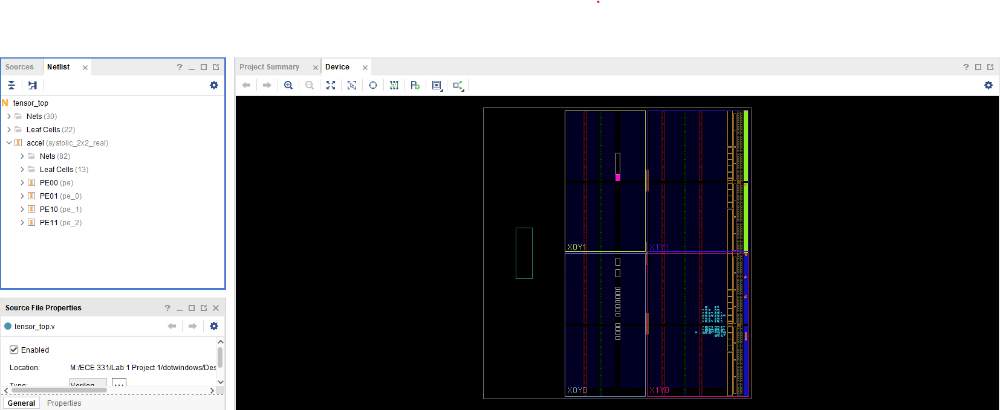
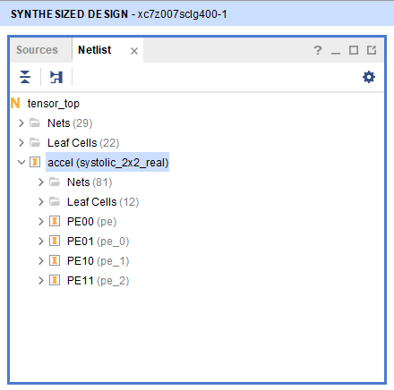
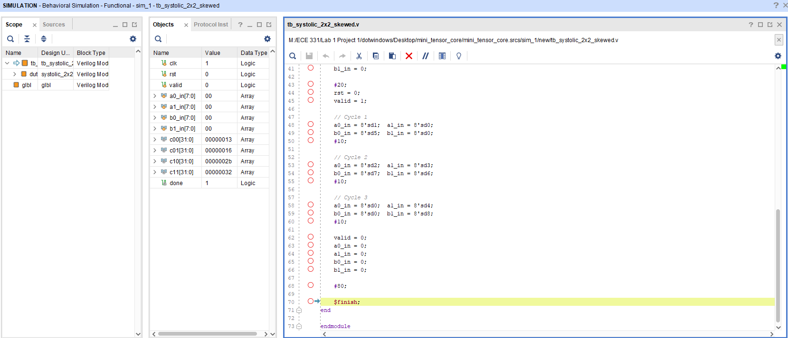
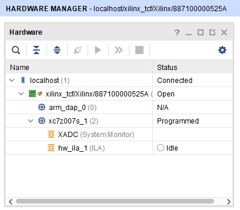
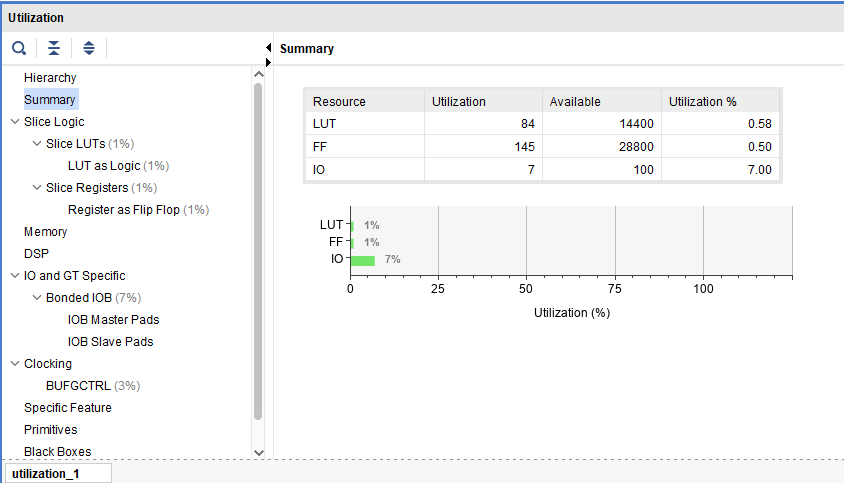
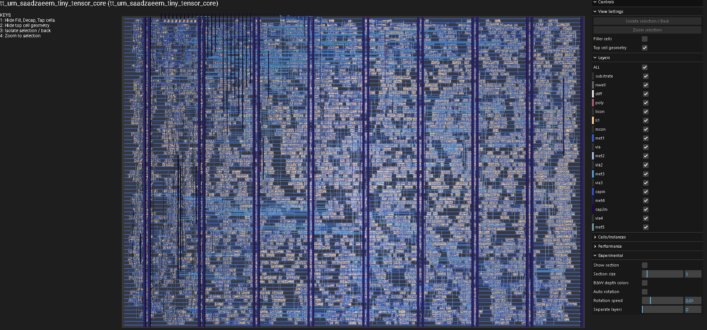

  

# Tiny Tensor Core

An INT8 2x2 systolic-array matrix multiplication accelerator designed in Verilog and implemented through the Tiny Tapeout SKY130 flow.

## Features

- 2x2 INT8 systolic-array matrix multiplication
- ReLU activation
- Programmable INT8 requantization
- Cycle-count performance counter
- Byte-strobe command interface
- Randomized cocotb verification against a Python golden model
- Passing Tiny Tapeout GDS, precheck, gate-level simulation, and viewer workflows
- Validated on a Xilinx Zynq-7000 FPGA

## Commands

| Command | Value | Description |
|---|---:|---|
| LOAD | 0xA0 | Load matrix A and B values |
| COMPUTE | 0xB0 | Start accelerator computation |
| READ | 0xC0 | Read INT8 outputs and cycle count |
| SHIFT | 0xD0 | Set requantization right-shift amount |

## Output Format

READ returns:

1. C00 INT8
2. C01 INT8
3. C10 INT8
4. C11 INT8
5. Cycle count low byte
6. Cycle count high byte

## Verification

The design is verified using cocotb with randomized INT8 test matrices. The hardware output is compared against a Python golden model that performs matrix multiplication, ReLU, requantization, and saturation.

# Project Images

## RTL Architecture

## Systolic Array Hierarchy

## Simulation Results

## FPGA Validation

## FPGA Hardware Validation

The design was synthesized and programmed onto a Xilinx Zynq-7000 FPGA board using Vivado Hardware Manager for hardware validation.

## FPGA Resource Utilization

## Status

Tiny Tapeout flow passing:

- docs
- test
- gds
- precheck
- gate-level test
- viewer

## Results

- Tiny Tapeout flow: passing docs, test, gds, precheck, gate-level simulation, and viewer
- FPGA validation: deployed on Xilinx Zynq-7000 Blackboard
- Verification: randomized cocotb tests against Python golden model
- Features: systolic array, ReLU, INT8 requantization, register-mapped interface, cycle counter

## Final ASIC Layout (GDS)

The design successfully completed the Tiny Tapeout SKY130 ASIC implementation flow, generating a manufacturable GDSII layout.

